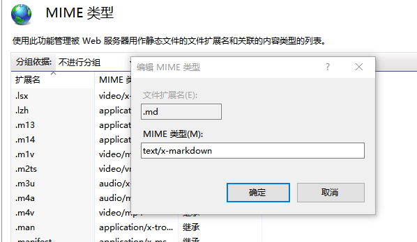

### 基于使用IIS服务器请求.md文件类型无法访问的解决访问】在 IIS MIME 类型中添加 md 扩展名【md文件是特殊的格式】

#### 设置方式
使用 <kbd>Win</kbd>+<kbd>R</kbd>输入<kbd>inetmgr</kbd> 打开IIS管理器

在IIS管理器中，对网站IIS下MIME类型进行设置。

添加文件扩展名为：.md

添加MIME 类型为：text/x-markdown

|  表头   | 表头  |
|----|----|
| 单元格  | 单元格 |
| 单元格  | 单元格 |

