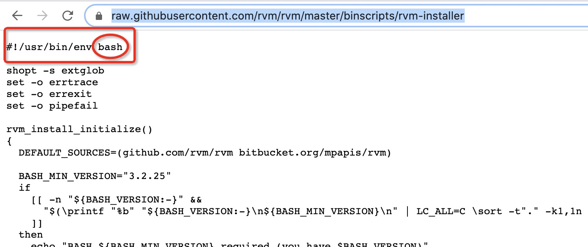
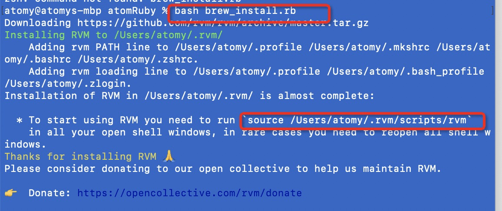
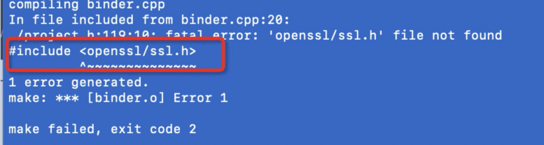
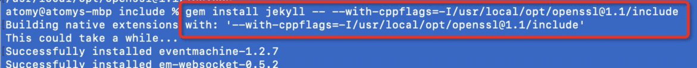


<!-- 使用`raw`, `endraw`实现下面""语句不被jekyll解析）
If you are using a language that contains curly braces, you will likely need to place `raw` and `endraw` tags around your code. Since Jekyll 4.0 , you can add render_with_liquid: false in your front matter to disable Liquid entirely for a particular document.
-->

# Jekyll

Jekyll is a simple, extendable, static site generator. You give it text written in your favorite markup language and it churns through layouts to create a static website. Throughout that process you can tweak how you want the site URLs to look, what data gets displayed in the layout, and more.

You can create your own blog website by:   
* Create an index.html or some pages in githup project named `<your github username>.github.io`, `master` branch. Or put index.html in another project(like 'blog') branch `gh-pages`, your domail will be `<your github username>.github.io/blog`.
* Fork some good blog then add your own pages and config. [Like here](https://github.com/jekyll/jekyll/wiki/Sites)
* Find a good framework then design for yourslf. Like [jekyll-now](https://github.com/barryclark/jekyll-now) and [jekyll-boostrap](https://github.com/plusjade/jekyll-bootstrap/)

## One. install 安装

### Requirements

- [Ruby](https://www.ruby-lang.org/en/downloads/) version 2.4.0 or above, including all development headers (ruby version can be checked by running `ruby -v`)
- [RubyGems](https://rubygems.org/pages/download) (which you can check by running `gem -v`)
- [GCC](https://gcc.gnu.org/install/) and [Make](https://www.gnu.org/software/make/) (in case your system doesn’t have them installed, which you can check by running `gcc -v`,`g++ -v` and `make -v` in your system’s command line interface)

### Jekyll on Windows

#### Installation via RubyInstaller

The easiest way to run Jekyll is by using the RubyInstaller for Windows.

1. Download and Install a `Ruby+Devkit` version from [RubyInstaller Downloads](https://rubyinstaller.org/downloads/). Use default options for installation.
2. Run the `ridk install` step on the last stage of the installation wizard. This is needed for installing gems with native extensions. You can find addtional information regarding this in the [RubyInstaller Documentation](https://github.com/oneclick/rubyinstaller2#using-the-installer-on-a-target-system)
3. Open a new command prompt window from the start menu, so that changes to the `PATH` environment variable becomes effective. Install Jekyll and Bundler via: `gem install jekyll bundler`
4. Check if Jekyll installed properly: `jekyll -v`
   That’s it, you’re ready to use Jekyll!


### Jekyll on Mac

#### install rvm   
mac 内置了ruby, gem,但是内置的ruby 无法执行`gem install jekyll`安装jekyll, 通过下面的命令可以安装rvm(ruby的命令行管理工具).   

安装ruby的方法有很多[ruby-org](https://www.ruby-lang.org/en/documentation/)  
我在安装过程中遇到不少问题： 比如说`curl: (7) Failed to connect to raw.githubuserconte`， 网上有建议说可以通过`https://www.ipaddress.com/` 网站查询 `raw.githubuserconte` 的常用ip, 并将对应映射配置在`/etc/hosts` 文件， 我尝试了没有用，网上还有其它方法 [传送门](https://blog.csdn.net/qq_43531694/article/details/106862753)。   

最后发现`curl -L get.rvm.io | bash`命令中`get.rvm.io`会重定向到`https://raw.githubusercontent.com/rvm/rvm/master/binscripts/rvm-installer` ，科学上网后我们可以直接使用这个网址打开， 把内容拷贝下俩放到rvm_install.rb文件中（文件名可以随意 /_drafts/rvm-installer.rb） .   

执行`bash rvm_install.rb` 命令 安装rvm（bash命令取决于rvm_install.rb文件中首行代码类型，这里首行代码显示是bash）


执行该文件并按提示安装：   


安装rvm成功后可以安装需要的ruby版本：`rvm install ruby-3.0.0`    
安装成功后`rvm list`命令可以查看安装的版本列表

安装好rvm 和ruby后成功了一大半，接着可以通过`gem install jekyll` 命令来安装jekyll. 在安装过程中出现`openssl/ssl.h`文件找不到的情况, 


通过`brew install openssl`命令可以查询电脑上是否已经安装过openssl.   

`brew --prefix openssl`命令 找到openssl的安装路径.  

尝试过把openssl文件夹拷贝到报错的文件目录下，但是这个安装过程是会将安装文件夹内容清空后重新安装，所以复制行不通，无意中在一片文章中看到配置文件引用的做法，可行。   



`gem install jekyll -- --with-cppflags=-I/usr/local/opt/openssl@1.1/include
`   命令成功安装jekyll.   
其中`/usr/local/opt/openssl@1.1/include` 是openssl安装路径 . 

### check jekyll version

check your Jekyll Version, execute one of two commands as below:

```yml
$ jekyll --version
$ gem list jekyll

```

你可以在 RubyGem 找到任何 gem 软件包的最新版本，同时也可以通过 gem 命令行工具来查看：

`$ gem search jekyll --remote`  
这样你会查到名为 jekyll 的 gem 包，并且在方括号中显示最新版本。另一个检查本机是否是最新版本的办法是执行命令`gem outdated`， 它会显示出当前系统中所有需要更新的 gem 包列表，如果你的 jekyll 不是最新版本，执行命令：

`$ gem update jekyll`

---

## Two. Create a project 创建项目

```yml
~ $ gem install jekyll
~ $ jekyll new myblog
~ $ cd myblog
~/myblog $ jekyll serve
// => Now browse to http://localhost:4000

```

如果你希望把 jekyll 安装到当前目录，你可以运行 jekyll new . 来代替。如果当前目录非空，你还需要增添 --force 参数，所以命令应为 jekyll new . --force

### folder directory [Check More](https://jekyllrb.com/docs/structure/)

````yml
  + root
      - index.html   //homepage
      - _config.yml  //global configuration (YAML)
      + _posts       //articles
          - year-month-day-articleTitle.extention(md/txt/html...) //force limite file name format
      + _layouts     //template
        - default.html   //template file
      + _include     //also like template, usually store some public pages here like header.html, footer.html
          - head.html
      + _data         //usually store some data like navigation item
          - fileName.yml(like navigation.yml)   //"site.data.fileName"(site.data.navigation) can get the file data, and you can use "for" read it.   
      + _plugins       // store some plugins. 
      + assets        //store img, css, js   
          + css
              - fileName.scss(like main.scss)    //this file import files in folder _sass. for example: @import "index". The pages can add link and href redirect to the /assets/css/main.css, then we can get the stylesheet in index.scss
      + _sass
          - fileName.scss(like index.scss)
      + customerFolder
      + collectionFolder  //need config in _config.yml. Collections are similar to posts except the content doesn’t have to be grouped by date. for example (https://jekyllrb.com/docs/step-by-step/09-collections/):
                          ```yml
                              // config in _config.yml
                                + collections:
                                    + authors:
                                        - output: true|false //output a page for documents yes or not
                          ```
                          then create a folder in the root of the site named `_*collection_name*`. In this case, `_authors`.
      + _sites    //after build, all generated pages was stored here

````


`jekyll new project`之后不能通过`jekyll serve` || `bundle exec jekyll serve`运行项目. 出现类似于`gems/jekyll-4.2.0/lib/jekyll/commands/serve/servlet.rb:3:in require: cannot load such file -- webrick (LoadError)` 错误。
> this happens because webrick is no longer a bundled gem in Ruby 3.0. From https://www.ruby-lang.org/en/news/2020/12/25/ruby-3-0-0-released/:

> The following libraries are no longer bundled gems or standard libraries. Install the corresponding gems to use these features.
>```yml
  sdbm
  webrick
  net-telnet
  xmlrpc
  Adding gem "webrick" to my Gemfile solves the problem, but Jekyll should include it in its gemspec.   

>```

  Mac works fine but on Windows facing issue like `Liquid Exception: Liquid error (line 13): invalid byte sequence in UTF-8 in sitemap.xml` when we use `jekyll-sitemap` plugin. That's maybe happened because we have Chinese file or folder name in our projcect. Rename the folder/file name by English character, or exclude this file/folder in `_config.yml` can solve this issue.


### config in `_config.yml`

```yml
  // config options https://jekyllrb.com/docs/configuration/options/
  // default configuration in _config.yml https://jekyllrb.com/docs/configuration/default/
  // Disable Disk Cache
  disable_disk_cache: true

  // Listen on the given port.
  port: 4000

  // Open the site's URL in the browser.
  open_url: true

```

### Build

1. `jekyll build` - Builds the site and outputs a static site to a directory called `_site`.  
   `jekyll build --destination <destination>` - 当前文件夹中的内容将会生成到目标文件夹<destination>中.  
   `jekyll build --source <source> --destination <destination>` - 指定源文件夹<source>中的内容将会生成到目标文件夹<destination>中.  
   `jekyll build --watch` - 当前文件夹中的内容将会生成到 ./\_site 文件夹中，查看改变，并且自动再生成.
2. `jekyll serve` - Does the same thing except it rebuilds any time you make a change and runs a local web server at `http://localhost:4000`.
3. `jekyll clean` - Remove the `_sites` folder.

---

## Three. How to code

1.  Linquid sytax [check more](https://shopify.github.io/liquid/basics/introduction/)
    1.1. Objects  
     Objects tell Liquid where to output content. They’re denoted by double curly braces: `{{` and `}}`. For example:  
    `{{ page.title }}`  
     1.2. Tags  
     Tags create the logic and control flow for templates. They are denoted by curly braces and percent signs: ``.

      a. `for`  limit 控制循环次数 forloop.index下标从1开始，forloop.index0下标从0开始   

    ``     

     b. `if` 辑“与或”分别是`and`,`or`  
      内容 1  内容 2  内容 3   
     For Example:

         ```yml

           
             <div class="sidebar">
               sidebar content
             </div>
           

         ```

    c. 'unless'   
     内容    

    d. 'assign'
       

    e. 'capture'

    ```
      I am being captured.
      {{ my_variable }}

    ```

    f. 'case/when'

    ```
      
      
        
          This is a cake
        
          This is a cookie
        
          This is not a cake nor a cookie
      

    ```

    1.3. [Filters] (https://jekyllrb.com/docs/liquid/filters/)
    Filters change the output of a Liquid object. They are used within an output and are separated by a `|`. For example:

    ```yml
     {{ "hi" | capitalize }}
     // Outputs `Hi`

    ```

    ```
      
      
      
      <ul>
        
          <li>{{ item }}</li>
        
      </ul>

     outPut: 
     <ul>
        <li>apple</li>
        <li>orange</li>
        <li>banana</li>
        <li>pinepal</li>
        <li>watermalen</li>
        <li>grap</li>
      </ul>


      get compile datetime-{{ "now" | date: "%Y-%m-%d %H:%M"}} 
      

    ```

    `` 调用某篇文章的链接，post_url 右边是不包含文件后缀的文件名，举个栗子:  
     `[Name of Link]()`  
     `` 代码高亮以及显示行数

    {: .table .table-atom}
    | command | explain |  
     | ----- | ----- |  
     | xml_escape | XML 转码 |  
     | uri_escape | URI 转码 |  
     | number_of_words | 统计页面字数 |  
     | 被注释的 内容  | 注释 |  
     | strip_html | 将 HTML 标签去除 |  
     | truncate:300 | 截取 300 字符 |  
     | date: "%B %-d, %Y" | 时间格式 |

    1.4 include

     调用 \_include 文件夹中 XXX 文件  
      通过 include 标签传递参数  
     {{ include.param }} 调用上述放出传递的参数  
     [Link to a post]() use the `link` tag to create a link in Markdown,

2.  Front Matter(文件头部的 yaml 配置)   
    Front matter is a snippet of YAML which sits between two triple-dashed lines(`---`) at the top of a file. Front matter is used to set variables for the page.  
    You can set 'title', 'layout', 'tags',' permalink', etc. variables for the page here. for example: set `permalink: /news/jekyll-update` in the specify page, you can via `site_url/news/jekyll-update` to open this page.

---

## pagination 分页

include the jekyll-paginate plugin in your `_config.yml` under plugins. then install it, like `gem install jekyll-paginate`  
and add paginate plugins setting as below:

```yml
 plugins: [jekyll-paginate]  //plugin name. Also can write as: plugins: - jekyll-paginate

 paginate: 3   //item count on each page.


```

### Pagination only works within HTML files

Pagination does not work from within Markdown files from your Jekyll site. Pagination works when called from within the HTML file,
named `index.html`, which optionally may reside in and produce pagination from within a subdirectory, via the paginate_path configuration value.

### 在子页中添加分页功能:

在根目录下新建一个文件夹 blogs,在该文件夹中新建一个文件`index.html`(文件名固定，改为其他不能达到效果)，index.html 文件中添加获取 list 的循环已经分页代码； `_config.yml`中设置 `paginate_path: "/blogs/page:num/"`，build 之后对应的页面会生成在`_site\blogs`中：

>  paginate_path: "/blogs/page:num/"  /*files generate to folder "blogs" and the subfolder is page2,page3....page:num.
> Jekyll does not generate a ‘page1’ folder*/

```yml
  |+ blogs
      |- index.html
      |+ page2
          |- index.html
      |+ page3
          |- index.html
          .
          .
          .
      |+ page:num
          |- index.html

```

### noticed: Don't set a permalink

Setting a permalink in the front matter of your blog page(blogs/index.html) will cause pagination to break. Just omit the permalink.

---

## Add Comment

### 1. Gitalk comment

a. Login github，navigate to Setting/Developer settings，create a `OAuth App`,fulfill `application name`，`homepage url`，`callback url`.
b. Add `gitalk js` and `css` in your page.

```yml
# <link rel="stylesheet" href="//cdn.bootcss.com/gitalk/1.5.0/gitalk.min.css"/>
# <script src="//cdn.bootcss.com/gitalk/1.5.0/gitalk.min.js"></script>

```

c. Create a html element [`div` or some element you like]，then create a `new Gitalk` object in your page, like below:   

``` html

   <!-- <div id="gitalk-container" style="margin: 30px;padding-bottom: 30px;"></div> -->

```

```yml
  # var gitalk = new Gitalk({
  #   clientID: '', // GitHub Application Client ID
  #   clientSecret: '', // GitHub Application Client Secret
  #   repo: '',      // 存放评论的仓库
  #   owner: '',          // 仓库的创建者，
  #   admin: [],        // 如果仓库有多个人可以操作，那么在这里以数组形式写出
  #   id: decodeURI(location.pathname),      // 用于标记评论是哪个页面的，确保唯一，并且长度小于50
  #   title: document.title,
  #   body:  '文章链接：'+ decodeURIComponent(location.origin+location.pathname)
  # })   

  # gitalk.render('gitalk-container');    // 渲染Gitalk评论组件

```

### 2. 网易云跟帖 评论

```yml

  
    <!-- 网易云跟帖 评论框 start -->
    <div id="cloud-tie-wrapper" class="cloud-tie-wrapper"></div>
    <!-- 网易云跟帖 评论框 end -->
  

  
    <!-- 网易云跟帖JS代码 start -->
    <script src="https://img1.cache.netease.com/f2e/tie/yun/sdk/loader.js"></script>   

    <script>
      var cloudTieConfig = {
        url: document.location.href,
        sourceId: "",
        productKey: "",
        target: "cloud-tie-wrapper"
      };
      var yunManualLoad = true;
      Tie.loader("", true);
    </script>
    <!-- 网易云跟帖JS代码 end -->
  

```

### 3. disqus 评论

```yml

  
    <!-- disqus 评论框 start -->
    <div class="comment">
      <div id="disqus_thread" class="disqus-thread"></div>
    </div>
    <!-- disqus 评论框 end -->
     

  
  <!-- disqus 公共JS代码 start (一个网页只需插入一次) -->
    <script type="text/javascript">
        /* * * CONFIGURATION VARIABLES * * */
        var disqus_shortname = "{{site.disqus_username}}";
        var disqus_identifier = "{{page.id}}";
        var disqus_url = "{{site.url}}{{page.url}}";

        (function() {
            var dsq = document.createElement('script'); dsq.type = 'text/javascript'; dsq.async = true;
            dsq.src = '//' + disqus_shortname + '.disqus.com/embed.js';
            (document.getElementsByTagName('head')[0] || document.getElementsByTagName('body')[0]).appendChild(dsq);
        })();
    </script>
  <!-- disqus 公共JS代码 end -->
  

```

### 4. 来必力评论功能

```yml
<div id="lv-container" data-id="city" data-uid="{{ site.livere_uid }}"></div>

<script type="text/javascript">
  (function(d, s) {
  var j, e = d.getElementsByTagName(s)[0];

  if (typeof LivereTower === 'function') { return; }

  j = d.createElement(s);
  j.src = 'https://cdn-city.livere.com/js/embed.dist.js';
  j.async = true;

  e.parentNode.insertBefore(j, e);
  })(document, 'script');
</script>

<noscript> 为正常使用来必力评论功能请激活JavaScript</noscript>

```

---

## Plugins
[ jekyll-monthly-archive-plugin](https://github.com/shigeya/jekyll-category-archive-plugin/blob/master/_plugins/category_archive_plugin.rb)   


## Ajax 获取动态数据

```yml
  <ul class="test">

  </ul>

  <script src="https://libs.baidu.com/jquery/2.0.0/jquery.min.js"></script>

  <script type="module">
    demo().then(res => {
      var arr =res
      let temp_dom = ''
      arr.forEach((item,index)=>{
        temp_dom += `<li>${item.name}+123</li>`
      })
      $('.test').html(temp_dom)
  })

    import {ajax} from '/assets/js/util.js'
    function demo() {
      return ajax({
        type: 'get',
        url: 'http://localhost:3001/products',
      });
    }
  </script>

```

## Reference

- [jekyllrb-docs](https://jekyllrb.com/docs/)

- [Jekyllbootstrap](http://jekyllbootstrap.com)

- [jekyll-github](https://github.com/jekyll)

- [jekyll-assets](https://github.com/envygeeks/jekyll-assets/blob/master/README.md)
- [Jekyll 使用技巧](https://blog.kelu.org/tech/2017/04/19/tips-for-jekyll-you-should-know.html)
- [jekyll webpack vue](https://github.com/cschweda/jekyll-vue-boilerplate)

