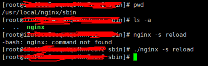

---
tags:
  - linux
  - nginx
---

## Nginx 安装
check [deploy-nginx-on-aliyun]()

1. 查看 nginx 安装目录 

`ps -ef | grep nginx`

2. 查看配置文件 nginx.conf 路径 

`nginx -t`

这条命令也可以用于检查配置文件是否正确。

当然也可以使用 find 命令进行文件查找
```
  // 从 / 根目录下查找文件名为 nginx.conf 的文件
  find / -name nginx.conf
  // 从 /etc 目录下查找文件名为 nginx.conf 的文件
  find /etc -name nginx.conf

```

[如何找出nginx配置文件的所在位置？](https://www.cnblogs.com/qianpangzi/p/10922420.html)


## 启动nginx
指定配置文件并启动 nginx 服务

`nginx安装目录 -c nginx.conf配置文件目录`

其中：参数 “-c” 指定了配置文件的路径，如果不加 “-c” 参数，Nginx 会默认加载其安装目录的 conf 子目录中的 nginx.conf 文件。
>  Nginx 的参数包括：<br> 
-c <path_to_config>：使用指定的配置文件而不是 conf 目录下的 nginx.conf   <br> 
-t：测试配置文件是否正确，在运行时需要重新加载配置的时候，此命令非常重要，用来检测所修改的配置文件是否有语法错误   <br> 
-v：显示 nginx 版本号     <br> 
-V：显示 nginx 的版本号以及编译环境信息以及编译时的参数    <br>  
nginx -s reload 重启nginx     <br> 
tail -f /var/log/nginx/ 查看日志  tail -f /var/log/nginx/access.log      <br>   
举例：       <br> 
检测新的配置文件：       <br> 
> ```yml
>   /usr/local/nginx/sbin/nginx -t -c /usr/local/nginx/conf/nginx.conf 
> ```

## -bash: nginx: command not found 解决方案
我已经安装好了Nginx，然后也把Nginx启动了，此时想重新加载一下Nginx，然后输入命令，但是发生了下面的错误：

我将Nginx安装在该路径下： `/usr/local/nginx`

启动Nginx，需进入路径：`/usr/local/nginx/sbin`

进入上述路径后，启动Nginx：
`./nginx`



但是要调用这个东西的时候都要到这里来，那就有点麻烦了,所以
1. 就干脆把Nginx的路径配置到系统变量中,配完需要重启系统

`注`----后来发现使配置文件生效不需要重启系统,只需要输入 

 `source /etc/profile`

 让配置文件重新生效一下即可

修改  `vim /etc/profile`  文件里面的内容

2. 或者另一种方法，

`ln -s /usr/local/nginx/sbin/nginx /usr/local/bin/`

 也可以全局访问nginx. 

`ln –s 源文件 目标文件`

源文件: /usr/local/nginx/sbin/nginx 就是nginx位置

目标文件: /usr/local/bin/ 就是环境变量目录

Linux ln（英文全拼：link files）命令是一个非常重要命令，它的功能是为某一个文件在另外一个位置建立一个同步的链接。
n的链接分 软链接 和 硬链接 两种：
>软链接就是：“ln –s 源文件 目标文件”，只会在选定的位置上生成一个文件的镜像，不会占用磁盘空间，类似与windows的快捷方式。
>硬链接ln源文件目标文件，没有参数-s， 会在选定的位置上生成一个和源文件大小相同的文件，无论是软链接还是硬链接，文件都保持同步变化。
>删除硬/软链接用 rm softlink_file 或者 unlink softlink_file  
>ll 软连接(softlink_file) 查看到软连指向的具体文件


## 关闭nginx
`nginx -s stop` 或 `pkill nginx`

## 宝塔
[宝塔Linux面板https://www.bt.cn/](https://www.bt.cn/)： 是提升运维效率的服务器管理软件，支持一键LAMP/LNMP/集群/监控/网站/FTP/数据库/JAVA等100多项服务器管理功能。
`bt default` 查看面板地址，登录用户名密码
`cd /www/server/panel/data` --> `cat admin_path.pl` 查看面板地址初始的机器码


## 命令配置
### nginx配置单页应用之路由匹配以及404页面   
[Nginx设置404页面转发](https://www.cnblogs.com/sunscheung/p/4533540.html)   
```
  location / {
    try_files $uri $uri/ /index.html;

    # if (!-e $request_filename){
    # 	rewrite ^(.*)$ /$1.html	break;
    # }
  }

  error_page  404           = [the page that you want to redirect to, for example https://www.baidu.com];
  error_page  403           = [the page that you want to redirect to, for example https://www.baidu.com];
  
``` 

```
  try_files指令
  语法：try_files file ... uri 或 try_files file ... = code
  默认值：无
  作用域：server location
  这种写法try_files $uri $uri/ /index.html;就会导致所有找不到的url都会跳转到index.html文件。

```

### 配置https(443)
```
  server {
        listen 80;
        server_name [server name];
        return 301 https://$server_name$request_uri;
  }
  server {
        listen 443 default ssl;
        ssl_certificate   [pem path].pem;
        ssl_certificate_key  [key path].key;
        server_name [server_name];

        root [root path];

        location / {
                try_files $uri $uri/ /index.html;
                proxy_http_version 1.1;
                proxy_set_header Upgrade $http_upgrade;
                proxy_set_header Connection 'upgrade';
                proxy_set_header Host $host;
                proxy_cache_bypass $http_upgrade;
                proxy_set_header X-NginX-Proxy true;
                proxy_set_header X-Real-IP $remote_addr;
                proxy_set_header X-Forwarded-For $proxy_add_x_forwarded_for;
                expires 300;
        }
  }

```

### 配置请求某个简短内容的文件   

场景如：微信公众号开发过程中需要配置`JS接口安全域名`   


```
  location /[fileName].txt {
      return 200 '[short content]';
  }

```


## 错误解决方案
1. [emerg] unexpected "}"  
解决方案: 大括号里面每行结尾需要分号的  


## 其他
1. 查看进程列表（条件过滤）  
`ps -ef | grep nginx`  

2. 直接查看进程pid  
`ps -C nginx -o pid`  

3. 查看80端口运行的程序  
`netstat -anp | grep :80`

## openssl generate local cert
1. `openssl> genrsa -des3 -out {path}/server.key 2048`

2. `openssl> req -new -key {path}/server.key -out {path}/server.csr`
if we face `Unable to load config info from /usr/local/ssl/openssl.cnf` issue
we can use openssl.cnf in git
`openssl> req -new -key {path}/server.key -out {path}/server.csr -config "C:\Program Files\Git\mingw64\ssl\openssl.cnf"` 

3. 生成秘钥 写RSA秘钥
`openssl> rsa -in {path}/server.key -out {path}/server_nopwd.key`

4. 生成CA证书 获取私钥
`openssl> x509 -req -days 3650 -in {path}/server.csr -signkey {path}/server_nopwd.key -out {path}/server.crt`

## Reference   
[Nginx 服务器安装及配置文件详解](https://www.cnblogs.com/bluestorm/p/4574688.html)


