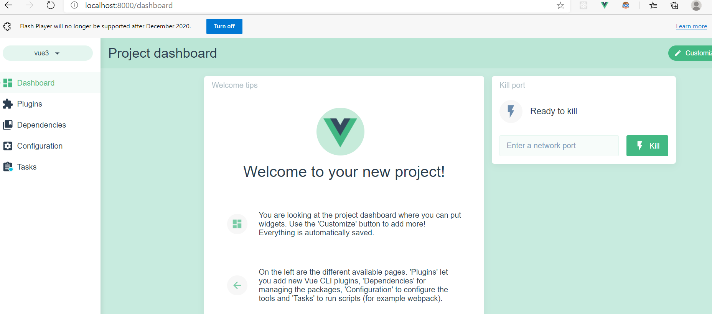

## How to create vue3 + Typescript project

@[TOC](目录)
<!-- TOC -->

  - [How to create vue3 + Typescript project](#how-to-create-vue3--typescript-project)
- [One. install vue-cli](#one-install-vue-cli)
- [Two. Creating a Project](#two-creating-a-project)

<!-- /TOC -->

# One. install vue-cli
  `npm install -g @vue/cli @vue/cli-service-global`   
 or   
  `yarn global add @vue/cli @vue/cli-service-global`   

# Two. Creating a Project
  #### vue create
  To create a new project, run:
  `vue create <Project name>`    

  #### Using the GUI
  `vue ui`
The above command will open a browser window with a GUI that guides you through the project creation process. 

