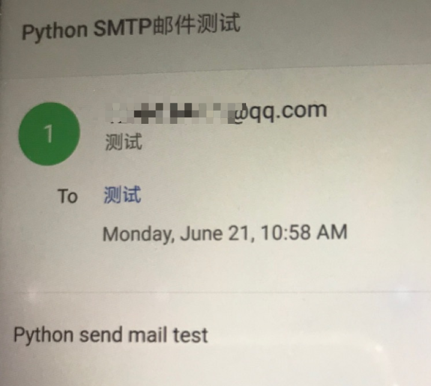

### 配置环境

我看很多人学习python都用的pycharm，确实比较强大，但是一方面pycharm专业版需要收费，另一方面还要多装个应用，所以我决定还是使用强大的vscode来开始python学习之路   
1. 下载vscode
2. 下载python解释器 <https://www.python.org/>(建议安装python3) 并安装，配置环境变量， mac自带了python2.7 python3.8. 可以通过`whereis python`, `where python`, `python`, `python -V` 等来检测是否已经安装了python
3. 在vscode中安装python插件
4. 新建一个文件夹作为项目存放地址, vscode 打开这个文件夹并新建一个**.py文件，可以看到vscode左下角的工具栏中自动加载了python解释器(如，Python 3.9.5 64-bit('python3')), 点击vscode左下角工具栏的python解释器后vscode上中部出现选择解释器的选项，这时候我们可以选择想要的解释器，选择之后项目更目录下会自动生成.vscode文件夹，该文件夹下面有个settings.json文件，其中配置了
```
{
  "python.pythonPath": "C:\\[python解释器路径]"  # windows 
  "python.pythonPath": "/usr/[python解释器路径]" # mac/linux
}
```

如果我们想给当前项目创建一个单独的虚环境，可以打开vscode控制台，cd到项目根目录运行 `python -m venv venv(名字可改)`，会在项目根目录下生成venv(名字可改)文件夹，该文件夹下scripts文件夹中包含了python解释器，pip.这时候我们可以再次点击vscode左下角的python解释器，选择刚刚创建的venv虚环境下的解释器(或直接将虚环境venv下python路径拷贝到.vscode->settings.json文件中替换python.pythonPath的值), 重新打开vscode控制台我们可以看到创建的venv虚环境被激活，如果没有可以执行`source 项目目录/venv/Scripts/activate`.

执行`pip install 包名`安装需要的包，该文件会被存放在venv/Lib/site-packages目录下

### python生成requirements.txt的两种方法

python项目如何在另一个环境上重新构建项目所需要的运行环境依赖包？

使用的时候边记载是个很麻烦的事情，总会出现遗漏的包的问题，这个时候手动安装也很麻烦，不能确定代码报错的需要安装的包是什么版本。这些问题，requirements.txt都可以解决！

生成requirements.txt，有两种方式：

第一种 适用于 单虚拟环境的情况： 

`pip freeze > requirements.txt`
为什么只适用于单虚拟环境？因为这种方式，会将环境中的依赖包全都加入，如果使用的全局环境，则下载的所有包都会在里面，不管是不是当前项目依赖的.

当然这种情况并不是我们想要的，当我们使用的是全局环境时，可以使用第二种方法。

第二种 (推荐) 使用 pipreqs ，github地址为： <https://github.com/bndr/pipreqs>

`pip install pipreqs` 安装pipreqs

`pipreqs . --encoding=utf8 --force` 在当前目录生成requrements.txt文件
注意 `--encoding=utf8` 为使用utf8编码，不然可能会报`UnicodeDecodeError: 'gbk' codec can't decode byte 0xae in position 406: illegal multibyte sequence` 的错误。

`--force` 强制执行，当requirements.txt存在时覆盖。

使用requirements.txt安装依赖的方式：

`pip install -r requirements.txt`


### Python SMTP发送邮件 <https://www.runoob.com/python/python-email.html>

```python

import smtplib
from email.mime.text import MIMEText
from email.header import Header

sender = "XXX@qq.com"
receivers = ["XXX@outlook.com"]
# 第三方 SMTP 服务
mail_host = "smtp.qq.com"  # 设置服务器
mail_user = "XXX"  # 用户名
mail_pass = "XXX"  # 口令 什么是授权码，它又是如何设置？ -- https://service.mail.qq.com/cgi-bin/help?subtype=1&&id=28&&no=1001256

message = MIMEText("Python send mail test", "plain", "utf-8")
message["From"] = Header("runoob", "utf-8")
message["To"] = Header("测试", "utf-8")

subject = "Python SMTP邮件测试"
message["Subject"] = Header(subject, "utf-8")

try:
    smtpObj = smtplib.SMTP()
    smtpObj.connect(mail_host, 25)  # 25 为 SMTP 端口号
    smtpObj.login(mail_user, mail_pass)
    smtpObj.sendmail(sender, receivers, message.as_string())
    print("send mail successfully")
except smtplib.SMTPException as e:
    print("Error:", e)

```

