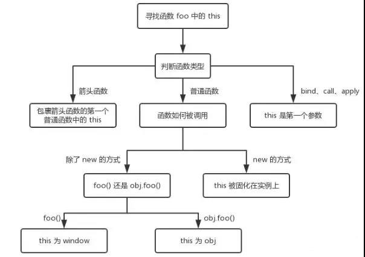

https://interview.codespring.top/webpack/improve_build.html

[JavaScript 面试核心考点(精华)](https://www.cnblogs.com/abc-x/p/11161374.html)

this 指向问题汇总：

[浅析 JavaScript 解析赋值、浅拷贝和深拷贝的区别](https://www.cnblogs.com/chengxs/p/10788442.html)

|        | 和原数据是否指向同一对象 | 第一层数据为基本数据类型 | 原数据中包含子对象       |
| ------ | :------------------------: | :------------------------: | :------------------------: |
| 赋值   | 是                       | 改变会使原数据一起改变   | 改变会使原数据一起改变   |
| 浅拷贝 | 否                       | 改变不会使原数据一起改变 | 改变会使原数据一起改变   |
| 深拷贝 | 否                       | 改变不会使原数据一起改变 | 改变不会使原数据一起改变 |

JSON.parse(JSON.stringify(str)) 深拷贝的问题：

（1）会忽略 `undefined`

（2）会忽略 `symbol`

（3）不能序列化函数

（4）不能解决循环引用的对象

（5）不能正确处理`new Date()`, 转换结果不正确,解决方法转成字符串或者时间戳就好了

（6）不能处理正则

[html常见面试题及答案]<https://blog.csdn.net/weixin_45102270/article/details/113064446> 什么是微格式，html5离线缓存， 拖拽释放(Drag and drop) API