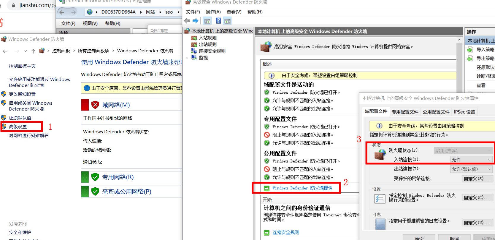

## Win10如何配置电脑的IIS实现局域网内IP访问网站

第一步、 打开windows10系统的 `控制面板`  

第二步、 打开 控制面板 后打开 `window 防火墙`

第三步、点击`高级设置`选项后打开`高级安全 Windows 防火墙`

第四步、点击`高级安全 Windows 防火墙`右侧的`Windows (Defender) 防火墙属性`选项

第五步、点击`域配置文件`--`防火墙状态`--`入站链接`设为`允许`选项

第六步(可选)、`专用配置文件`，`公用配置文件`等`入站链接`设为`允许`选项

第七步、`确定`

现在其他局域网内的人是不是可以打开你的网站了呢

一图胜千言:

